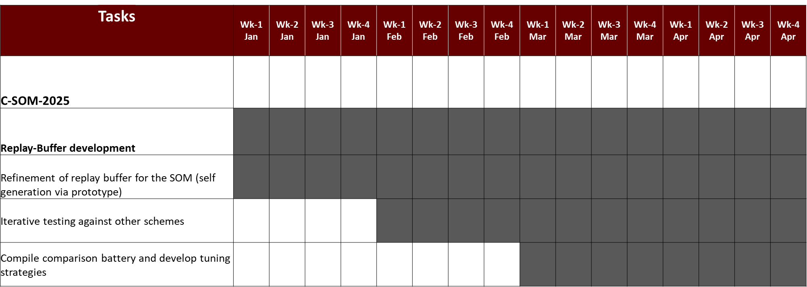

# Timeline

This is our timeline document. It will record both our projected timelines, and our progress along them.

## Stages

### Stage 1

#### Updates:

Note: For updates prioer to 2024/10/08, please refer to Update_log.md.

##### 2024/10/08:

We are behind, moving, setting ourselves back up, and a number of logistical matters consumed most of the end of september.

However, we are confident in our long-term timeline, especially due to the introduction of several salient tools which would need to have been adopted eventually, and which are being moved forward to the month of October.

In response to this emergency, we've upgraded project time to ~33 hrs a week, which we believe will be sustainable outside of a conference in November. Cooking has been reduced to a once a week event, and we now start work at 0600 eastern, ensuring our 8 hour workday is done by 1400, making our afternoon and early evening free to work completley upon the dissertation.

By the end of october we will:

- [ ] Become functional in Gitlab (The testing CI/CD pipeline will be important for automating the sanity checks for the many SOM variants).
	- [x] Review basics of git
	- [ ] Git bash-scripting review/demo
- [ ] Become functional in Docker (The containerization will facilitate a decoupleing of the data-supply and the SOM instance, rendering a realistic and easily adaptable online test).
	- [x] Complete tutorial
- [ ] Aquire/set up primary development computer (Rapid testing is projected to require more powerful hardware, and so we have invested our own capital into a modest but sufficient workstation).
	- [x] Parts ordered
	- [ ] Set-up
- Resume compilation of the target SOM-variant list to extend beyond:
	1. GSOM
	2. GHSOM
	3. ESOM
	4. IGG
	5. PCSOM
	6. REISOD
	7. CSOM (Viadya et al.)

###### Additional:

From Novemeber 10th-13th we will be presenting lab-work at the 2024 World-Forum internet-of-things conference in Ottawa, an honor an a privial both to have been accepted and to represent the lab. We will put our best foot forward and understand that we are a representative of MSU and PATENT at this presigious academic gathering. 

Viewers can expect weekly, and subweekly, updates here in the future.

### Stage 2

### Stage 3

### Stage 4

