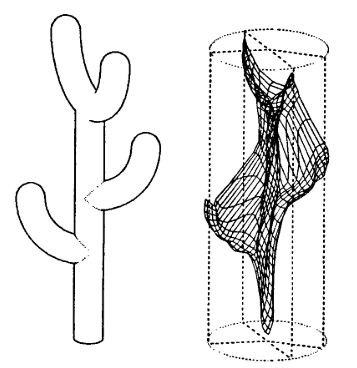

# Headings...
## The first heading stole the secret of font-size from the gods.
### As punishment, the gods kept the heading, and all its kind, seperate from the content.
#### Forever held above the world they made more organized.
##### But I am here to save them.
###### I will bring them back to the surface.

At last they are free.

# Paragraphs

This line is in the same paragrpah...
...as this line...

This line...

Is in a seperate paragraph from this line...

Paragraphs are seperated from one another by `>=` 1 blank line.

# Linebreaks

These lines, with  
`>=` 2 ending spaces   
and a have linebreaks  
if you end the line with a return

# Italics

*There* are _multiple_ ways to add italics, they can be done i*nsid*e a w*or*d a*swel*l.

# Bolds

**Bold** text works s**imilarl**y

# Both bold-and-italic

***Both*** e***ffect***s c***a***n be ***achieved***

## *Italics* work in headings, but b**old**s don't

# Blockquotes

> A paragraph with a `>` before it is a blockquote.

# Blockquotes with multiple paragraphs

> Blockquotes with multiple paragraphs  
> 
> need `>` in between the lines.

# Nested blockquotes

> You can next blockquotes
>
>> Like this
>>
>>> Using multiple `>`s  
>>
>> You can return to earlier levels
>
> Like this

# Blockquotes with other elements

> Not every markdown element can be placed in a blockquote
> - But lists
> - can be

# Lists

1. Lists 
1. make
1. the 
2. world 
0. more 
003. organized

- they
- do
- not
- need
- to 
- be
- numbered

## There are nested lists (thank goodness)

1. You
2. use
    1. indentation
    2. to make
4. nested lists.
5. You can return to outer lists easily.

* The
- bullets
+ can
    - be
        + formed
            * in many ways.
            
# Elements in lists

1. This  
    is a pargaraph in line with its list item.
2. And this
    > is a blockquote in line with its item.  
    > "Do reproducable research."

## Checklists

- [x] Checklists
- [a] Have
- [ ] A
- [ ] Special
    - [ ] Struct-
    - [ ] ure

# Code-blocks

Be careful with  
    
    indents...

Indents are used to specify code blocks. An indent is 4-spaces or 1-tab. In a list, double that.

Code blocks render code nicely:

    def recursive_reverser(list_):
        print(list_)
        if len(list_):
            return([list_[-1]] + recursive_reverser(list_[:-1]))
        else:
            return []

But the tripple accute environ lets you render them specific to their language, but only in the `.md` file:

``` Python
def recursive_reverser(list_):
    print(list_)
    if len(list_):
        return([list_[-1]] + recursive_reverser(list_[:-1]))
    else:
        return []
```

# Images

Images can be added using filepaths


Images can also be added using URLs:


# Code

## Code snippets 

Tick marks (') are used to bound code snippets `def like_this()`.

``If the code snippet has ` you want to print, you can do this.``

## Code blocks

    Indenting
    Every
    Line
    The same amount
    makes a code block.

# Horizontal Lines

---

You can make horizontal lines. I'm not sure they render in the darkmode viewer I'm using.

---

# Links

[Links are created like images](https://github.com/Bit-Byte-Bit/C-SOM-25)

[The links can have titles too](https://github.com/Bit-Byte-Bit/C-SOM-25 "Which show up as rollover text")

# Web and email addresses

<https://github.com/Bit-Byte-Bit/C-SOM-25>
<alexander.m.sommer@gmail.com>

# Formatting links

*[Italic links](https://github.com/Bit-Byte-Bit/C-SOM-25)*

**[bold links](https://github.com/Bit-Byte-Bit/C-SOM-25)**

# Two part links

## The first part

[The text][the_label]  
[Text 2][a]

## The second part

[the_label]:https://github.com/Bit-Byte-Bit/C-SOM-25
[a]:https://github.com/Bit-Byte-Bit/C-SOM-25 "titles"

# Escaped characters

Some characters, such as the \* chatacter, oringarily aren't printed, but they can be escaped with the \\ character.

# Tables

---
| Tables | Can |
|---|---|
| Be | Made |
| As | Well |
---

## Alignment

---
| And | Alignment | Can |
|:--- | :---: | ---:|
| Be | set | In |
| The | Columns | Seperatley |
---